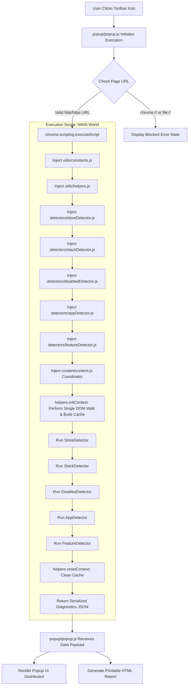

# System Architecture & Codebase Structural Documentation

This document explains the software architecture, design patterns, security model, and directory structure of the **Shopify Store Inspector & Diagnostics** Chrome Extension.

---

## 1. System Architecture Diagram



---

## 2. Directory & Structural Breakdown

```text
shopify_extension/
├── manifest.json                  # Manifest V3 Extension Configuration
├── CODEBASE_EXPLANATION.md        # Line-by-Line & Theoretical Documentation
├── INSTALLATION_AND_USAGE_GUIDE.md# User Installation & Usage Manual
├── ARCHITECTURE_DOCUMENTATION.md  # Software Architecture & Structural Design
├── README.md                      # General Overview Documentation
├── background/
│   └── background.js              # Service Worker Lifecycle Script
├── content/
│   └── content.js                 # MAIN World Orchestration Script
├── detectors/
│   ├── storeDetector.js           # Shopify Verification & Theme Metadata Engine
│   ├── stackDetector.js           # Core E-Commerce Architecture Detector
│   ├── disabledDetector.js        # Inactive Script & Hidden Element Scanner
│   ├── appDetector.js             # Third-Party App Signature Scanner (27 Apps)
│   └── featureDetector.js         # Storefront Capability Detector (15 Features)
├── utils/
│   ├── constants.js               # App Signatures & System Constants
│   └── helpers.js                 # DOM Caching, RegEx Escaping & Confidence Engine
├── popup/
│   ├── popup.html                 # Extension Popup UI Layout
│   ├── popup.css                  # Responsive Extension Styling
│   └── popup.js                   # Popup Logic, DOM Binding & HTML Report Generator
└── icons/
    ├── icon16.png                 # Toolbar Icon (16x16)
    ├── icon48.png                 # Extension Management Icon (48x48)
    └── icon128.png                # Chrome Web Store Icon (128x128)
```

---

## 3. Core Software Design Patterns

### 3.1 Single-Pass DOM Caching Pattern
Instead of each detector executing multiple `document.querySelectorAll()` queries, the extension executes a single DOM walk via `helpers.initContext()` before running detectors:
- Pre-collects script tags, stylesheet hrefs, disabled scripts, and HTML comment nodes into `helpers._cache`.
- Reduces DOM traversal overhead from $O(N \times M)$ to $O(N)$ where $N$ is DOM nodes and $M$ is the number of detectors.
- Frees the cache memory immediately after scan completion using `helpers.resetContext()`.

### 3.2 Weighted Signal & Confidence Evaluation Engine
Detectors do not rely on binary true/false checks. Instead, each signal carries an assigned weight (e.g., Global JS Object = 40%, External Script = 35%, DOM Container = 25%).
- Total confidence percentage is computed as:
  $$\text{Confidence} = \frac{\sum \text{Detected Signal Weights}}{\sum \text{Total Signal Weights}} \times 100$$
- Classifies findings into four clear states: `Detected` ($\ge 80\%$), `Possible` ($>0\%$), `Not Detected` ($0\%$), and `Unavailable`.

### 3.3 DRY Parameterized Detection Pattern
To add support for new apps or features, zero detector code changes are required:
- Developers add signature rules to `utils/constants.js`.
- The `appDetector` and `disabledDetector` modules dynamically iterate through configuration rules.

---

## 4. Manifest V3 Security & Isolation Architecture

1. **Minimal Privilege Principle**:
   - `activeTab`: Privileges are granted temporarily only when the user interacts with the extension.
   - `scripting`: Required to inject script code dynamically into target tabs.
2. **Main World Context Injection**:
   - Script execution uses `world: "MAIN"`, allowing access to `window.Shopify` while keeping background service workers isolated from malicious page content.
