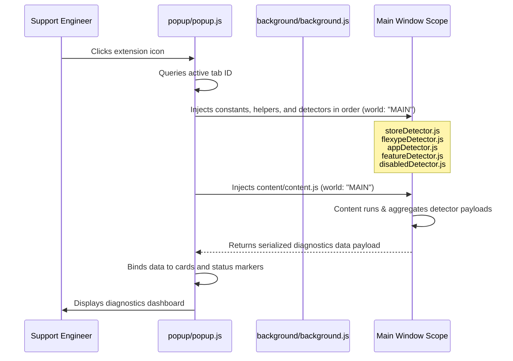

# Shopify Store Diagnostics Console

A production-quality, Manifest V3 Chrome Extension designed for Product Support Engineers at FlexyPe to automate the checking of Shopify storefront environments, FlexyPe product integrations, third-party apps, storefront features, and disabled/latent scripts directly template-side.

---

## 🏛️ Architecture & Extension Execution Flow

Standard Manifest V3 extensions run content scripts in an **isolated world** which guarantees security but restricts their access to page-level window properties (e.g. `window.Shopify`, `window.ShopifyAnalytics`, custom widget configs). 

To resolve this limitation, this extension utilizes the following execution sequence:



---

## 📁 Project Structure

```text
shopify-diagnostics/
├── manifest.json            # Manifest V3 configuration with minimal permissions
├── README.md                # Engineering documentation
├── .gitignore               # Excludes dev artifacts from version control
├── background/
│   └── background.js        # Service worker activation listener
├── content/
│   └── content.js           # Coordinator: initializes cache, runs detectors, returns payload
├── detectors/
│   ├── storeDetector.js     # Shopify metadata, theme info & page type (triple-layer)
│   ├── flexypeDetector.js   # Multi-signal FlexyPe validator (7/6/6 signals per product)
│   ├── disabledDetector.js  # Parameterized disabled detection (comments, hidden, scripts, config)
│   ├── appDetector.js       # Third-party app detector (27 apps, collapsed category scoring)
│   └── featureDetector.js   # 15 storefront capabilities (3 signals each)
├── utils/
│   ├── helpers.js           # Cached DOM scanning, regex escaping, confidence evaluation engine
│   └── constants.js         # Third-party app signatures & detection constants
├── popup/
│   ├── popup.html           # Dark Console visual UI template
│   ├── popup.css            # Responsive layout & custom scroll bars
│   └── popup.js             # Tab query, DOM renderer, and Export Report generator
└── icons/
    ├── icon16.png           # 16x16 icon
    ├── icon48.png           # 48x48 icon
    └── icon128.png          # 128x128 icon
```

---

## 🚀 Installation & Loading Unpacked Extension

1. Clone or download this project's folder to your local drive.
2. Open Google Chrome.
3. In the address bar, type and navigate to: `chrome://extensions/`
4. Enable **Developer mode** using the toggle switch in the top-right corner.
5. Click the **Load unpacked** button in the top-left corner.
6. Browse and select the directory:
   `shopify-diagnostics/` (the folder containing `manifest.json`).
7. The extension will load as **Shopify Store Diagnostics**. You can pin the extension for easy access.

---

## 🛡️ Required Permissions Explanation

To maintain security and store standards, the extension requests the absolute minimum set of privileges required for operation:

* `activeTab`: Provides temporary host permissions to execute diagnostics when the user clicks the extension icon.
* `scripting`: Required to inject script code into the tab's `MAIN` world via `chrome.scripting.executeScript`.
* Host Permissions (`http://*/*`, `https://*/*`): Required because Shopify merchants use custom domains — allows MAIN world injection on any storefront.

---

## 🔍 Detection Strategy & Evidence Engine

To prevent false results, the detectors use a confidence-based multi-signal evaluation system with **cached DOM scanning** for optimal performance.

### Performance: Cached Scan Context
Before any detector runs, `helpers.initContext()` pre-collects all DOM elements into an internal cache:
- All `<script>` elements (src, textContent, type, disabled status)
- All `<link rel="stylesheet">` href values
- All HTML comment nodes (via `createNodeIterator`, capped at 500)

This eliminates repeated `querySelectorAll` calls across detectors — a single DOM walk serves all 5 detector modules.

### 1. Storefront Details (`storeDetector.js`)
- **8 independent Shopify signals**: `window.Shopify`, `ShopifyAnalytics`, CDN links/scripts, preconnect hints, and 3 meta tags.
- **Triple-layer page type detection**: ShopifyAnalytics meta → pathname + body classes + `data-template` → title fallback.
- **Cascading fallbacks**: 4-level for locale, 3-level for shop name, 3-level for Shopify domain.

### 2. FlexyPe Integrations (`flexypeDetector.js`)
Calculates a weight-based confidence score ($0-100\%$) using **7/6/6 signals** per product:
- **Global Variables** (Weight: 40) — `FlexyPe`, `FlexyPeCheckoutInstance`, `FlexyCheckout`
- **External Script URLs** (Weight: 35) — `flexype-sdk`, `checkout.flexype.com`, etc.
- **Inline Script References** (Weight: 15) — Configuration blocks in page scripts
- **DOM Containers** (Weight: 20-25) — IDs, classes, data attributes
- **Custom Elements** (Weight: 15) — `<flexype-checkout>`, `<flexype-button>`
- **Stylesheets** (Weight: 10) — CSS file references
- **Data Attributes** (Weight: 10) — `[data-flexype]`, `[data-flexy-checkout]`

### 3. Disabled Integrations (`disabledDetector.js`)
Parameterized detection (DRY pattern — adding new products requires only config, no code):
- HTML comment scanning via pre-cached comment nodes
- Disabled `<script>` detection (`type="text/plain"`, `type="text/x-template"`, `[disabled]`)
- Hidden DOM via `getComputedStyle` (`display:none`, `visibility:hidden`, `[hidden]`)
- Global configuration flags (`enabled: false`, `active: false`, `disabled: true`)

### 4. Third-Party Apps (`appDetector.js`)
**27 apps** across 8 categories with collapsed category scoring:
- Each signal category (scripts, globals, DOM) is evaluated as one signal
- Analytics tools (no DOM selectors) correctly score 100% with script + global match
- Apps with DOM selectors need 2+ categories for "Detected" status

### 5. Expansion Support
New apps can be added to `utils/constants.js` under the `THIRD_PARTY_APPS` array. Zero detector code changes required.

---

## ⚠️ Limitations

1. **Service Pages / Local files**: Diagnostics cannot execute on browser settings screens (`chrome://...`) or local files due to browser-level security policies.
2. **Pre-loading scans**: If a web page is extremely slow or fails to complete DOM initialization, the inject call might throw a timeout.
3. **Frames / Shadow DOMs**: Elements separated into sandboxed `iFrame` wrappers (not loaded on the same document domain) cannot be directly traversed.

---

## 🛠️ Future Improvements

* Network traffic inspection via `chrome.debugger` to monitor active AJAX requests.
* Options page GUI for customizing the third-party app detection list.
* Headless Shopify (Hydrogen) storefront detection.
* Automated test suite against known Shopify storefronts.

---

## 📸 Screenshots

| Dashboard Idle (Default) | Store Diagnostic Report (Shopify storefront active) |
| :---: | :---: |
| *[Screenshot Placeholder]* | *[Screenshot Placeholder]* |
