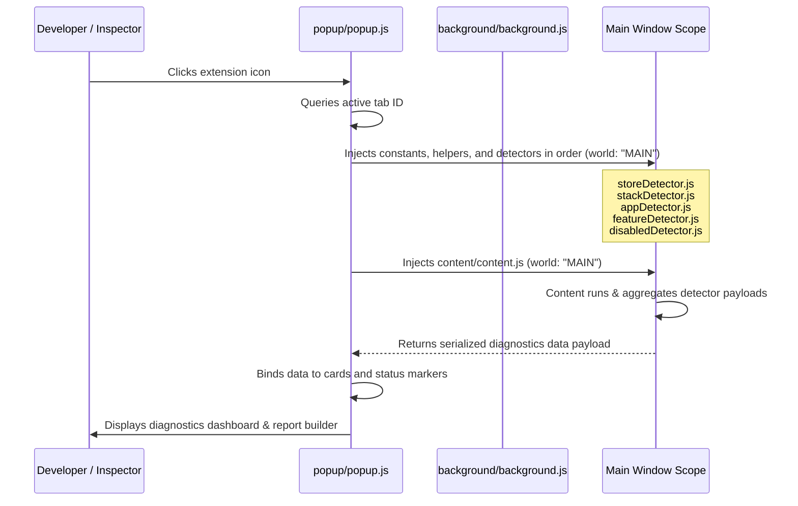

# Shopify Store Inspector & Diagnostics Console

A production-quality, white-labeled **Manifest V3 Chrome Extension** designed for Shopify Developers, Agency Partners, E-commerce Consultants, and Support Engineers to inspect, audit, and diagnose any Shopify storefront environment in real time.

---

## 🏛️ Architecture & Extension Execution Flow

Standard Manifest V3 extensions run content scripts in an **isolated world** which guarantees security but restricts their access to page-level window properties (e.g. `window.Shopify`, `window.ShopifyAnalytics`, custom theme configurations). 

To resolve this limitation, this extension utilizes the following execution sequence:



---

## 📁 Project Structure

```text
shopify-inspector/
├── manifest.json            # Manifest V3 configuration with minimal permissions
├── README.md                # Engineering documentation
├── .gitignore               # Excludes dev artifacts from version control
├── background/
│   └── background.js        # Service worker activation listener
├── content/
│   └── content.js           # Coordinator: initializes cache, runs detectors, returns payload
├── detectors/
│   ├── storeDetector.js     # Shopify metadata, theme info & page type (triple-layer)
│   ├── stackDetector.js     # Core e-commerce architecture (Checkout, Auth, Cart Engine)
│   ├── disabledDetector.js  # Inactive code detection (comments, hidden DOM, disabled scripts)
│   ├── appDetector.js       # Third-party app stack detector (27 apps, category scoring)
│   └── featureDetector.js   # 15 storefront capabilities (3 signals each)
├── utils/
│   ├── helpers.js           # Cached DOM scanning, regex escaping, confidence engine
│   └── constants.js         # Third-party app signatures & detection constants
├── popup/
│   ├── popup.html           # Modern Inspector visual UI template
│   ├── popup.css            # Responsive layout & custom scroll bars
│   └── popup.js             # Tab query, DOM renderer, and Export Report generator
└── icons/
    ├── icon16.png           # 16x16 icon
    ├── icon48.png           # 48x48 icon
    └── icon128.png          # 128x128 icon
```

---

## 🚀 Installation & Loading Unpacked Extension

1. Clone or download this project's folder to your local drive.
2. Open Google Chrome.
3. In the address bar, navigate to: `chrome://extensions/`
4. Enable **Developer mode** using the toggle switch in the top-right corner.
5. Click the **Load unpacked** button in the top-left corner.
6. Browse and select the directory containing `manifest.json`.
7. The extension will load as **Shopify Store Inspector & Diagnostics**. Pin the extension for quick access.

---

## 🛡️ Required Permissions

* `activeTab`: Provides temporary host permissions to execute diagnostics when the user clicks the extension icon.
* `scripting`: Required to inject script code into the tab's `MAIN` world via `chrome.scripting.executeScript`.
* Host Permissions (`http://*/*`, `https://*/*`): Required because Shopify merchants use custom domains — allows MAIN world injection on any storefront.

---

## 🔍 Detection Strategy & Evidence Engine

### Performance: Cached Scan Context
Before any detector runs, `helpers.initContext()` pre-collects all DOM elements into an internal cache:
- All `<script>` elements (src, textContent, type, disabled status)
- All `<link rel="stylesheet">` href values
- All HTML comment nodes (via `createNodeIterator`, capped at 500)

This eliminates repeated `querySelectorAll` calls across detectors — a single DOM walk serves all detector modules.

### 1. Storefront Metadata (`storeDetector.js`)
- **8 independent Shopify signals**: `window.Shopify`, `ShopifyAnalytics`, CDN links/scripts, preconnect hints, and meta tags.
- **Triple-layer page type detection**: ShopifyAnalytics meta → pathname + body classes + `data-template` → title fallback.
- **Cascading fallbacks**: Locale, Shop Name, Myshopify Domain, Theme Name, Theme ID, Theme Role (`main` vs `preview`).

### 2. Core Architecture Stack (`stackDetector.js`)
Evaluates 3 foundational e-commerce pillars:
- **Checkout & Payment Engine**: Shop Pay, dynamic payment buttons, express payment gateways (Apple Pay, PayPal), and custom checkout SDKs.
- **Customer Auth Stack**: Customer account meta, native login/register forms, and SSO/passwordless auth widgets.
- **Cart & Drawer Engine**: AJAX slide drawers, cart drawer triggers, and third-party cart drawer scripts.

### 3. Inactive Code & Disabled Traces (`disabledDetector.js`)
- HTML comment scanning via pre-cached comment nodes.
- Disabled `<script>` detection (`type="text/plain"`, `[disabled]`).
- Hidden DOM elements via computed style checks (`display:none`, `visibility:hidden`).

### 4. Third-Party App Stack (`appDetector.js`)
Scans **27 apps** across 8 categories (Marketing, Reviews, Analytics, Page Builders, Subscriptions, Chat, etc.):
- Collapsed category scoring ensuring script, global, and DOM evidence are weighted cleanly.
- Hover tooltips display exact verified signals.

---

## 📸 Screenshots

| Dashboard (Active Scan) | Exported Diagnostic Report |
| :---: | :---: |
|  |  |
