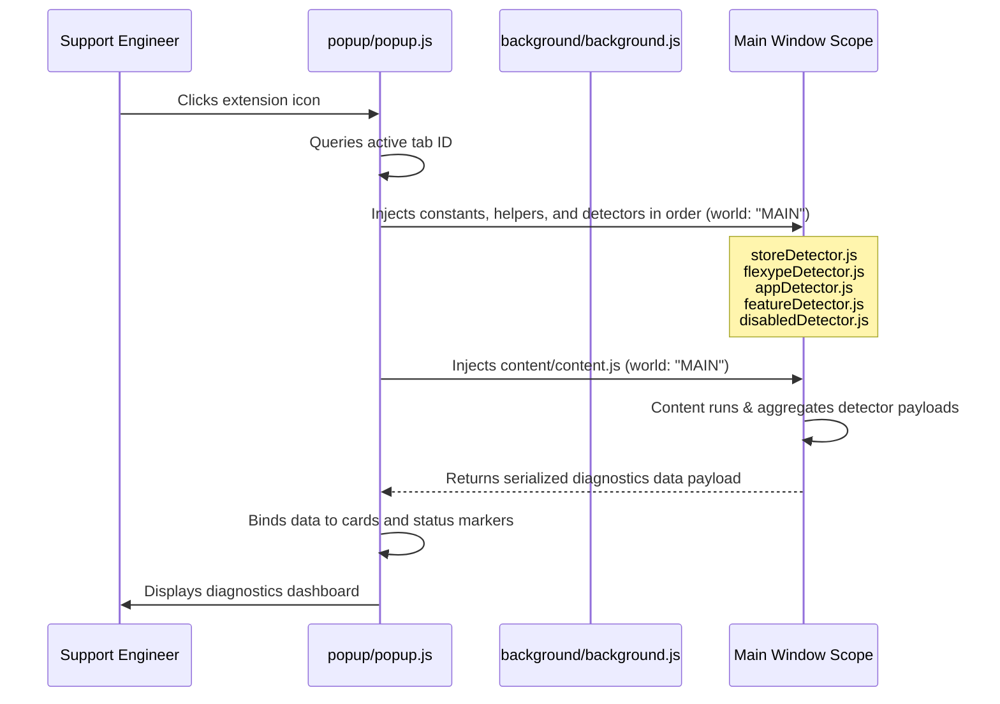

# Shopify Store Diagnostics Console

A production-quality, Manifest V3 Chrome Extension designed for Product Support Engineers at FlexyPe to automate the checking of Shopify storefront environments, FlexyPe product integrations, third-party apps, storefront features, and disabled/latent scripts directly template-side.

---

## 🏛️ Architecture & Extension Execution Flow

Standard Manifest V3 extensions run content scripts in an **isolated world** which guarantees security but restricts their access to page-level window properties (e.g. `window.Shopify`, `window.ShopifyAnalytics`, custom widget configs). 

To resolve this limitation, this extension utilizes the following execution sequence:



---

## 📁 Project Structure

```text
shopify-diagnostics/
├── manifest.json            # Manifest V3 configuration with minimal permissions
├── README.md                # Engineering documentation
├── background/
│   └── background.js        # Service worker activation listener
├── content/
│   └── content.js           # Main coordinator aggregating all checks
├── detectors/
│   ├── storeDetector.js     # Shopify metadata & page templates inspector
│   ├── flexypeDetector.js   # Multi-signal app validator (Checkout, Cart, Pass)
│   ├── disabledDetector.js  # Search comments & hidden nodes for inactive elements
│   ├── appDetector.js       # Third-party app & tracking pixel identifier
│   └── featureDetector.js   # Native search, accounts, and drawer capabilities
├── utils/
│   ├── helpers.js           # Safe selectors, global searchers, and confidence engines
│   └── constants.js         # Dictionary of target identifiers and third-party signatures
├── popup/
│   ├── popup.html           # Dark Console visual UI template
│   ├── popup.css            # Responsive layout & custom scroll bars
│   └── popup.js             # Tab query and DOM renderer binding
└── icons/
    ├── icon16.png           # Canvas generated 16x16 icon
    ├── icon48.png           # Canvas generated 48x48 icon
    └── icon128.png          # Canvas generated 128x128 icon
```

---

## 🚀 Installation & Loading Unpacked Extension

1. Clone or download this project's folder to your local drive.
2. Open Google Chrome.
3. In the address bar, type and navigate to: `chrome://extensions/`
4. Enable **Developer mode** using the toggle switch in the top-right corner.
5. Click the **Load unpacked** button in the top-left corner.
6. Browse and select the directory:
   `shopify-diagnostics/` (the folder containing `manifest.json`).
7. The extension will load as **Shopify Store Diagnostics**. You can pin the extension for easy access.

---

## 🛡️ Required Permissions Explanation

To maintain security and store standards, the extension requests the absolute minimum set of privileges required for operation:

* `activeTab`: Provides temp host permissions to execute diagnostics upon click.
* `scripting`: Required to inject script code into the tab's `MAIN` world.
* `tabs`: Allows querying the active tab to inspect its URL and load status.
* Host Permissions (`http://*/*`, `https://*/*`): Grants the right to inject content scripts into page DOMs to allow inspection of Shopify variables.

---

## 🔍 Detection Strategy & Evidence Engine

To prevent false results, the detectors represent a confidence-based multi-signal evaluation system:

### 1. Storefront details (`storeDetector.js`)
- Inspects core page states: `window.Shopify`, `window.ShopifyAnalytics.meta`.
- Leverages meta falls for localized variables, theme ids, and names.
- Scans `body` classes and paths (`/products/*`, `/collections/*`, `/account/login`) to identify the page type.

### 2. FlexyPe Integrations (`flexypeDetector.js`)
Calculates a weight-based confidence score ($0-100\%$) across:
- **Global Variables** (Weight: 40)
- **Loaded JavaScript URLs** (Weight: 35)
- **DOM Container Selectors** (Weight: 20/25)
- **Custom Elements tags** (Weight: 15)
- **CSS class identifiers** (Weight: 15)

### 3. Disabled Integrations (`disabledDetector.js`)
Assesses whether a product has been deactivated or silenced:
- Scans comment structures using `document.createNodeIterator` to locate commented-out code templates (e.g. `<!-- flexype-checkout-snippet -->`).
- Inspects script formats including code marked `type="text/plain"` (consent blocked or templating placeholders).
- Runs `window.getComputedStyle(element)` to confirm if integrated components are styled `display: none` or `visibility: hidden`.

### 4. Expansion Support
New apps can be added to `utils/constants.js` under the `THIRD_PARTY_APPS` array. They will automatically be inspected on the next scan step without modifying any detector code.

---

## ⚠️ Limitations

1. **Service Pages / Local files**: Diagnostics cannot execute on browser settings screens (`chrome://...`) or local files due to browser-level security policies.
2. **Pre-loading scans**: If a web page is extremely slow or fails to complete DOM initialization, the inject call might throw a timeout.
3. **Frames / Shadow DOMs**: Elements separated into sandboxed `iFrame` wrappers (not loaded on the same document domain) cannot be directly traversed.

---

## 🛠️ Future Improvements

* Support real-time Network traffic inspection via `chrome.debugger` to track active AJAX requests.
* Allow customization of the third-party list values directly from a options GUI page.

---

## 📸 Screenshots

| Dashboard Idle (Default) | Store Diagnostic Report (Shopify storefront active) |
| :---: | :---: |
| *[Screenshot Placeholder]* | *[Screenshot Placeholder]* |
